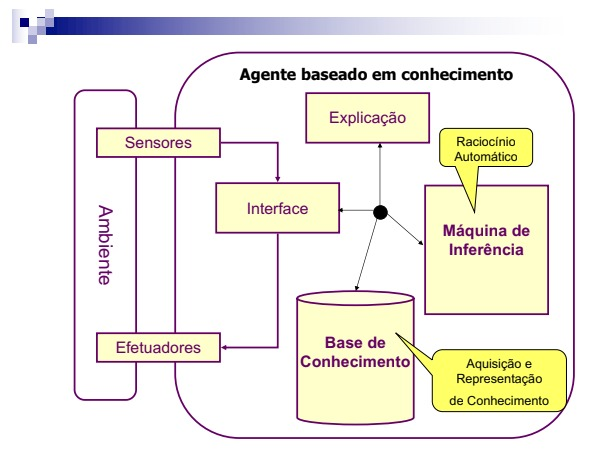

# Lista 2 de IA

## Aluno: Samuel Lucas Vieira Lins Barbosa

1. Com base na arquitetura conceitual de um agente baseado em conhecimento,  mostrada nas aulas e exibida a seguir, implemente um sistema de classificação,  indicando qual é o animal pensado pelo usuário (jogo de adivinhação), dentre um  conjunto de animais previamente mapeados. Para tanto, considere a base de  conhecimento a seguir, a qual deve ser ampliada por você, para incluir regras de  classificação de mais 2 animais, de sua livre escolha. Desenvolva uma interface que  assegure uma interação com o usuário, visando coleta de dados e outras trocas que se  façam necessárias (considere a ideia de uma árvore de decisão), bem como implemente um engenho de inferência para encadeamento de regras e as funções de explicação do  Por que e do Como. Como uma dica, veja como isso ocorreria numa implementação  usando a ferramenta Expert Sinta, demonstrada em sala de aula.  
Neste caso, considere uma memória de trabalho que se inicia vazia, ou seja, sem fato  algum. Assim, a máquina de inferência pode iniciar com encadeamento de regras,  fazendo perguntas para prosseguir sua análise usando encadeamento para trás. 

   * **R1**: Se o animal tem pelo então é um mamífero. 
   * **R2**: Se o animal dá leite então é um mamífero. 
   * **R3**: Se o animal tem penas então é uma ave. 
   * **R4**: Se o animal voa e bota ovos então é uma ave. 
   * **R5**: Se o animal é um mamífero e come carne então é um carnívoro. 
   * **R6**: Se o animal é um mamífero, tem dentes pontudos, garras e seus olhos são  frontais então é um carnívoro. 
   * **R7**: Se o animal é um mamífero e tem casco então é um ungulado. 
   * **R8**: Se o animal é um mamífero, rumina e tem dedos pares então é um  ungulado. 
   * **R9**: Se o animal é carnívoro, tem cor amarelo-tostado e manchas escuras então  é um leopardo. 
   * **R10**: Se o animal é carnívoro, tem cor amarelo-tostado e listras pretas então é  um tigre. 
   * **R11**: Se o animal é ungulado, tem pernas longas, pescoço comprido, cor  amarelo-tostado e manchas escuras então é uma girafa. 
   * **R12**: Se o animal é ungulado, tem cor branca e listras pretas então é uma zebra. **R13**: Se o animal é uma ave, tem pernas longas, pescoço comprido e é preto e  branco então é um avestruz. 
   * **R14**: Se o animal é uma ave, não voa, nada e é preto e branco então é um  pinguim. 
   * **R15**: Se o animal é uma ave e um bom voador então é um albatroz. 

Obs.: Caso você prefira resolver este problema sobre uma outra base de conhecimento,  alternativamente aceito substituir esta base de conhecimento por uma outra que trate  de adivinhar uma determinada série (dentre uma amostra previamente estabelecida), da Netflix, pensada pelo usuário, ou alguma outra aplicação similar que você possa  propor, passando por uma aprovação prévia. 

2) Com base na arquitetura conceitual de um agente baseado em conhecimento,  anteriormente mostrada, implemente um sistema de diagnóstico médico.  Considere a base de conhecimento hipotética seguinte, adaptada do Livro  Inteligência Artificial, do Ben Coppin, excetuando-se as regras R1 e R6). 
R1: SE Fadiga = sim E Dor_de_cabeça= sim E Dores_no_corpo = sim E  Ocasionais_dores_garganta = sim E Ocasionais_tosse = sim  
ENTÃO Covid19 = sim  
R2: SE Dor_de_cabeça = Sim E Garganta_inflamada = Sim E Tosse = Sim  ENTÃO Diagnóstico = Gripe  
R3: SE Cansaço = Sim E Dor_de_cabeça = Sim  
ENTÃO Diagnóstico = Mononucleose infecciosa  
R4: SE Cansaço = Sim E Garganta_inflamada = Sim 
ENTÃO Diagnóstico = Amigdalite  
R5: SE Cansaço = Sim ENTÃO Diagnóstico = Estresse 
R6: SE Fadiga = sim E Dor_de_cabeça = sim E Pulsação_elevada = sim E  Baixo_nível_de_oxigênio = sim E Perda de olfato = sim E Perda de paladar = sim  
ENTÃO Covid19 = sim  
MT = { } Diagnóstico = X 
3) Construa 3 versões de bases de conhecimento com regras do tipo SE...Então... a partir  da base de dados seguinte (ampliada com mais 6 exemplos E15, E16, E17, E18, E19,  E20, totalizando 20), usando os 4 algoritmos ID3, C4.5, CART e PRISM (ou JRipper ou  algum similar que gere regras diretamente dos dados). Apresente a descrição processo  de construção com as etapas de construção da árvore, nos casos do ID3, C4.5 e CART,  etapas de construção das regras, no caso do PRISM (ou similar). Discuta os resultados,  fazendo comparações. Para as construções com C4.5, CART e PRISM (ou similar), use  implementações deles disponíveis em alguma biblioteca de “Machine Learning” ou se  preferir, implemente os algoritmos e mostre o processo de construção e o resultado. 
Indução de Árvore de Decisão 
● Ex.: Conjunto de Exemplos de Avaliação de Risco de crédito: 
● 4 atributos e 3 classes (Baseado no livro do Luger: IA)
Historia de Crédito Dívida Garantia Renda Risco 
E1 Ruim Alta Nenhuma $0 a $15k Alto 
E2 Desconhecida Alta Nenhuma $15 a $35k Alto 
E3 Desconhecida Baixa Nenhuma $15 a $35k Moderado E4 Desconhecida Baixa Nenhuma $0 a $15k Alto 
E5 Desconhecida Baixa Nenhuma Acima de $35k Baixo 
E6 Desconhecida Baixa Adequada Acima de $35k Baixo 
E7 Ruim Baixa Nenhuma $0 a $15k Alto 
E8 Ruim Baixa Adequada Acima de $35k Moderado E9 Boa Baixa Nenhuma Acima de $35k Baixo 
E10 Boa Alta Adequada Acima de $35k Baixo 
E11 Boa Alta Nenhuma $0 a $15k Alto 
E12 Boa Alta Nenhuma $15 a $35k Moderado  E13 Boa Alta Nenhuma Acima de $35k baixo  
E14 Ruim Alta Nenhuma $15 a $35k Alto  
4) Elabore e implemente uma ferramenta para construção de sistema baseado em  conhecimento, com base na arquitetura conceitual do agente baseado em  conhecimento, mostrada anteriormente. Especificamente, esta ferramenta deveria  ter os módulos e funcionalidades similares ao Expert Sinta, considerando editor de  base de conhecimento, motor de inferência com encadeamento para trás,  explanação (Por quê? Como?) e interface com diálogo em linguagem natural. Para  avaliar a ferramenta desenvolvida, considere a base de conhecimento a seguir e a  que você obterá automaticamente (avaliação de risco de crédito), conforme  solicitado na questão 3. 
Regra1: Se Rendimento = Alto então conceda_empréstimo = Sim. Regra2: Se Rendimento = Médio E É_bacharel_ou_superior = Sim E  Tem_Emprego = Sim então conceda_empréstimo = Sim. 
Regra 3: Se Rendimento = Médio E É_bacharel_ou_superior = Sim E  Tem_Emprego = Não então continua_a_investigar = Sim. 
Regra 4: Se Rendimento = Médio E É_bacharel_ou_superior = Não E  Tem_Emprego = Não então conceda_empréstimo = Não. 
Regra 5: Se Rendimento = Médio E É_bacharel_ou_superior = Não E  Tem_Emprego = Sim então continua_a_investigar = Sim. 
Regra 6: Se Rendimento = Baixo E Referências = Boas então  continua_a_investigar = Sim. 
Regra 7: Se Rendimento = Baixo E Referências = Más então  conceda_empréstimo = Não. 
5) Explicabilidade é um tópico muito atual e relevante em IA, mas já sendo uma funcionalidade explorada desde a década de 70, no âmbito dos sistemas especialistas,  onde já havia investimento nesse tipo de funcionalidade. Além da explicabilidade,  também nessa mesma época já havia um investimento em interface baseada processamento de linguagem natural. Sobre esses 2 tópicos e mais os outros 2 da nossa  arquitetura conceitual, responda às duas questões seguintes, considerando o Sistema  Especialista Mycin, discutido em Sala de Aula. As questões são: (i) pesquise e descreva  como funciona os seus 4 principais módulos: Base de conhecimento, Engenho de  Inferência, Explicação e Interface em Linguagem Natural, na interação sistema-usuário.  Ilustre o funcionamento com a ajuda de exemplos. 
Obs.: Cada uma das 5 questões vale de 0 a 2 pontos.
